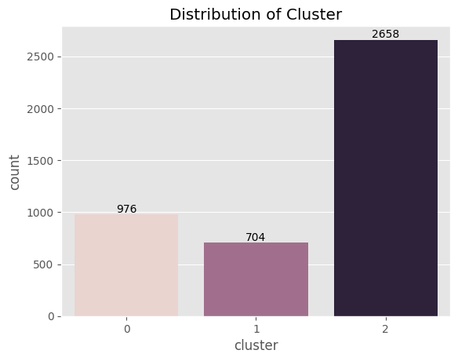

<h1 align="center">Customer_Segmentation</h1>

## Background ❓
In the highly competitive e-commerce landscape, understanding customer behavior and preferences is crucial for personalized marketing, targeted promotions, and enhancing customer experience. Traditional segmentation methods often fall short in capturing the complex and dynamic nature of customer interactions. Therefore, leveraging machine learning techniques for clustering can provide deeper insights and more granular customer segments.

## Problem Statement 🚨
Understanding the customer base is crucial for businesses aiming to enhance their service offerings. However, accurately identifying and segmenting customers into distinct groups is a complex and challenging task. Since not all customers are alike, a one-size-fits-all approach is ineffective for optimizing sales. The key to overcoming this challenge lies in comprehending the diverse needs and behaviors of customers. Fortunately, the advent of machine learning clustering techniques has significantly simplified this process, enabling businesses to achieve more precise and effective customer segmentation.

## Objective 🎯
The objective of this project is to develop an unsupervised machine learning model to cluster customers based on their purchasing behavior, demographics, and engagement metrics. These clusters will help the marketing team to tailor strategies for each segment, ultimately aiming to increase customer retention, satisfaction, and lifetime value.

## Solution 💡
This is an unsupervised learning clustering problem, where the goal is to segment the customer base into distinct groups. We will employ various machine learning clustering techniques, including K-Means Clustering, DBSCAN, and K-Medoids Clustering, to create these segments. We will evaluate the performance of these clustering models using metrics such as the Silhouette Score. The process will begin with Exploratory Data Analysis (EDA) to gain a deeper understanding of our dataset, followed by the application of the clustering algorithms. After comparing the clustering results based on the evaluation metrics, we will select the best-performing model for deployment. This approach will enable us to accurately identify and group customers, facilitating more targeted marketing strategies and personalized services to optimize sales and enhance customer satisfaction.

## 1. Exploratory Data Analysis 💾

I have obtained the data set and now it is time to perform an Exploratory data Analysis (EDA) to gain insight about the dataset and prepare the data for modeling purposes.

**1.1 Dataset**

The dataset is the historical sales data of a retail store that contains sales from 2010-12-01 to 2011-12-09 which is a total of 373 days. It has 8 features and 541,909 observations. This dataset has been referred from UCI ML Repository: https://archive.ics.uci.edu/ml/datasets/online+retail

The following are a short information of our feature :

InvoiceNo : Invoice number of the customers purchase 
StockCode : Stock coed for the item purchased by the customer
Description : Description of the product / Product name
Quantity : Number of item purchases
Invoice Date : Date of purchase 
Unit Price : Price of the item purchased 
Customer ID : ID of the purchasing customer
Country : Country where the purchase was made

**1.2 Data Preprocessing And Feature Engineering**
**1.2.1 Data Preprocessing**
After processing the data by cleaning and handling missing values, scaling features, capping outliers using the IQR technique, dropping unnecessary features, and performing feature engineering, we derived and retained the following features:

* `Recency`: Number of days it has been since the customers last purchase
* `Purchase_Frequency`: The number of purchase the customer has made
* `Amount_Spent`: The total amount a customer has spent

## 2. Data Visualization 
The following are the visualization of our dataset which show the distribution before and after scaling and outliers before and after capping:

<strong>Figure 1. Feature Distribution before scaling </strong>

<strong>Figure 2. Feature Distribution after scaling </strong>

<strong>Figure 3. Boxplot before capping outliers </strong>

<strong>Figure 4. Boxplot after Capping outliers </strong>

## 4. Evaluation

**4.1 Model Scores** 

The following are the scores for each of the models I used for clustering:

`K means Clustering:`

<strong>Silhouette score: 0.6483413204987358</strong>

<strong>Davies-Bouldin Index: 0.48547272199943725</strong>

<strong>Calinski-Harabasz Index: 23263.69839505305</strong>

`DBSCAN:`

<strong>Silhouette score: 0.5124535393925451</strong>

<strong>Davies-Bouldin Index: 0.3059262753930306</strong>

<strong>Calinski-Harabasz Index: 55.81098659050135</strong>

`K-Medoids:` 

<strong>Silhouette score: 0.6392076721049347</strong>

<strong>Davies-Bouldin Index: 0.5002676602413151</strong>

<strong>Calinski-Harabasz Index: 22700.2056197247</strong>

More detail about the evaluation metric is provided in the detailed report.

**4.2 Conclusion**

While DBSCAN has the lowest Davies-Bouldin Index, which suggests good separation and compactness, its lower Silhouette and Calinski-Harabasz scores indicate that it might not be the best overall performer for this dataset.K-Means shows the best performance across multiple metrics, making it the most suitable model for your clustering problem based on the provided evaluation criteria.

## 5. Customer Segments (Clusters)
**5.1 Cluster Visualization**
The K-mean has given us 3 distict cluster i.e. 0, 1 and 2. Each of these clusters are individual customer segment that has been visualized below:

<strong>Figure 5. Countplot for customer segment cluster </strong>

<strong>Figure 6. Histogram of feature with by customer segment clusters </strong>

<strong>Figure 7. Boxenplot of feature with by customer segment clusters </strong>

<strong>Figure 8. Boxplot of feature with by customer segment clusters </strong>

<strong>Figure 9. Scatter Plot of feature with by customer segment clusters </strong>

**5.2 Cluster Observation**

The following observations can be made about each of the customer segements:

`Cluster 0 (Neutral Customers)`

- There are 976 unique customers in this cluster 
- This group of customers are in the middle of heard in Recency, frequency and amount spent  
- The customer in this cluster have spent on average a total of $1500 a year
- On average the customer of this cluster made a purchase 55 days ago from the final date of record
- Throughout the year the customers in this cluster makes 90 different transaction on average

`Cluster 1 (Loyal Customers)`

- There are 704 unique customers in this cluster 
- This group of customers are mosts loyal ones with low Recency and high frequency and amount spent  
- The customer in this cluster have spent on average a more than of $3400 a year
- On average the customer of this cluster made a purchase 30 days ago from the final date of record
- Throughout the year the customers in this cluster makes 170 different transaction on average

`Cluster 3 (Infrequent Customers)`

- There are 2664 unique customers in this cluster
- This group of customers are in the lower end with high Recency, and low frequency and amount spent  
- The customer in this cluster on avg spend less than $500 a year
- On average the customer of this cluster made a purchase 125 days ago from the final date of record
- Throughout the year the customers in this cluster makes 30 different transaction on average
